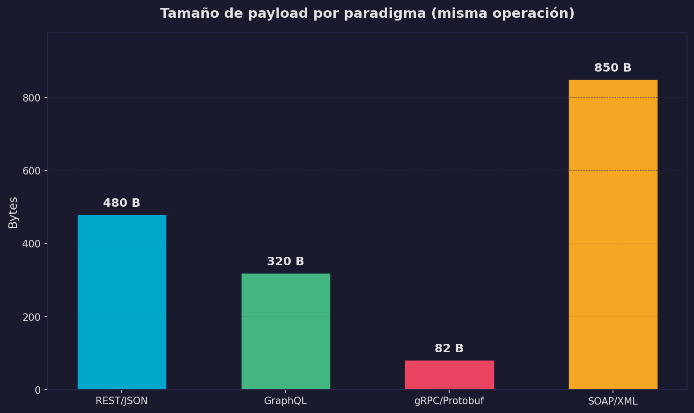
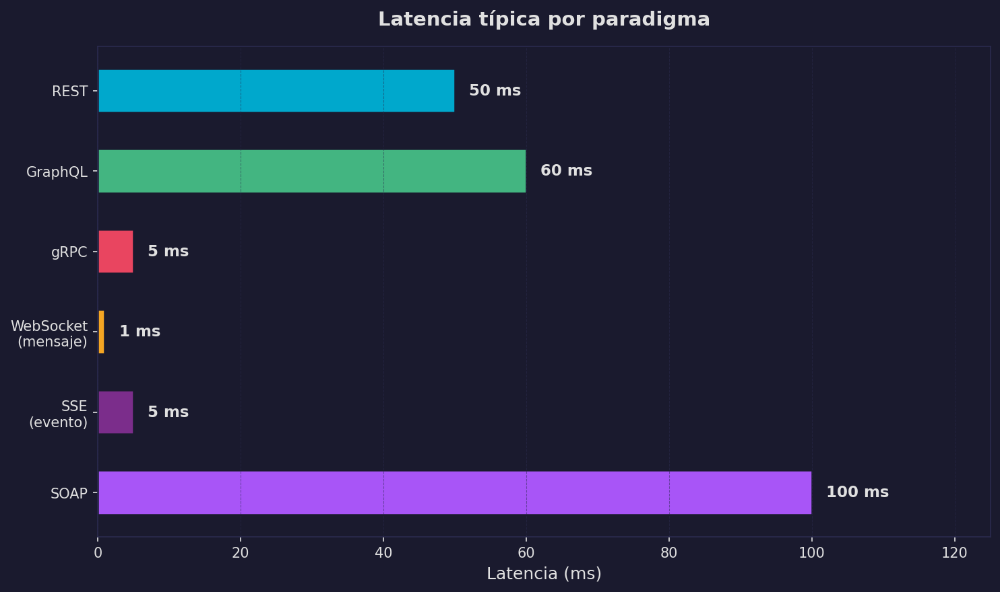

## No hay UN protocolo correcto

Despues de recorrer REST, SSE, WebSocket, polling, webhooks, GraphQL,
gRPC y SOAP, podrias sentir la tentacion de elegir un favorito y usarlo
para todo. Resiste esa tentacion.

**No hay UN protocolo correcto. Hay el protocolo correcto para CADA
conexion.**

Un sistema real -- como la arquitectura LLM que hemos analizado a lo
largo de esta seccion -- usa *varios* de estos paradigmas
simultaneamente, cada uno donde tiene mas sentido. Tu trabajo como
ingeniero de datos no es memorizar protocolos, sino saber cual encaja
en cada situacion.


## Tabla maestra de comparacion

```
  +------------+----------------+-------------+-----------+----------+---------------------------+
  | Paradigma  | Direccion      | Conexion    | Formato   | Latencia | Caso LLM                  |
  |            |                |             |           | tipica   |                           |
  +------------+----------------+-------------+-----------+----------+---------------------------+
  | REST       | Client->Server | Per-request | JSON      | ~50ms    | Chat completions API      |
  +------------+----------------+-------------+-----------+----------+---------------------------+
  | SSE        | Server->Client | Persistente | Texto     | ~5ms*    | Token streaming           |
  +------------+----------------+-------------+-----------+----------+---------------------------+
  | WebSocket  | Bidireccional  | Persistente | Cualquiera| ~1ms*    | Chat UI tiempo real       |
  +------------+----------------+-------------+-----------+----------+---------------------------+
  | Polling    | Client->Server | Per-request | JSON      | ~interval| Fine-tuning status        |
  +------------+----------------+-------------+-----------+----------+---------------------------+
  | Webhook    | Server->Client | Per-evento  | JSON      | ~evento  | Job completion notify     |
  +------------+----------------+-------------+-----------+----------+---------------------------+
  | GraphQL    | Client->Server | Per-request | JSON      | ~60ms    | Admin dashboard           |
  +------------+----------------+-------------+-----------+----------+---------------------------+
  | gRPC       | Bidireccional  | Persistente | Protobuf  | ~5ms     | Model serving interno     |
  +------------+----------------+-------------+-----------+----------+---------------------------+
  | SOAP       | Client->Server | Per-request | XML       | ~100ms   | Legacy enterprise         |
  +------------+----------------+-------------+-----------+----------+---------------------------+

  * Latencia despues de establecer la conexion. El handshake inicial es mayor.
```

Fijate en dos cosas:

1. **No hay un solo paradigma que domine todas las columnas.** REST es
   simple pero no hace streaming. WebSocket es rapido pero complejo de
   operar. gRPC es eficiente pero no funciona en navegadores.

2. **El sistema LLM usa al menos 5 de estos 8.** Eso no es accidente --
   cada conexion tiene requisitos diferentes.


## Arbol de decision

Cuando necesites elegir un protocolo para una conexion nueva, sigue
este arbol:

```
  Que necesitas?
  |
  +-- CRUD simple (crear, leer, actualizar, borrar)?
  |   |
  |   +---> REST
  |         Es el default. Si no tienes una razon especifica
  |         para usar otra cosa, usa REST.
  |
  +-- El servidor necesita enviar datos continuamente?
  |   |
  |   +-- Solo server -> client?
  |   |   |
  |   |   +---> SSE
  |   |         Mas simple que WebSocket. Reconexion automatica.
  |   |         Perfecto para streaming de tokens.
  |   |
  |   +-- Ambas direcciones?
  |       |
  |       +---> WebSocket
  |             Chat en tiempo real, juegos, colaboracion.
  |             Mas complejo de operar que SSE.
  |
  +-- Necesitas notificacion cuando algo ocurra?
  |   |
  |   +-- Tienes un servidor con URL publica?
  |   |   |
  |   |   +---> Webhook
  |   |         El servidor te avisa. No desperdicias requests.
  |   |
  |   +-- No tienes servidor publico?
  |       |
  |       +---> Polling con backoff exponencial
  |             Pregunta periodicamente, pero con inteligencia.
  |
  +-- El cliente necesita datos flexibles / multiples recursos?
  |   |
  |   +---> GraphQL
  |         Dashboards, apps moviles, casos donde
  |         over-fetching es un problema real.
  |
  +-- Comunicacion interna de alta performance?
  |   |
  |   +---> gRPC
  |         Microservicios, model serving, pipelines
  |         donde cada milisegundo cuenta.
  |
  +-- Sistema legacy basado en XML?
      |
      +---> SOAP
            No lo eliges. Lo heredas. Usa zeep y sobrevive.
```

La regla de oro: **empieza con REST.** Solo cambia a otro paradigma
cuando REST no pueda resolver tu problema especifico.


## Fortalezas y debilidades por paradigma

**REST**
- Fortaleza: universal, simple, debuggeable con curl
- Debilidad: no hace streaming, puede ser verboso para datos complejos
- Cuando NO usarlo: necesitas datos en tiempo real

**SSE**
- Fortaleza: streaming simple, reconexion automatica, funciona en browsers
- Debilidad: solo server->client, sin binario
- Cuando NO usarlo: necesitas comunicacion bidireccional

**WebSocket**
- Fortaleza: bidireccional, baja latencia, cualquier formato
- Debilidad: complejo de escalar, no hay cache, sin codigos de estado
- Cuando NO usarlo: solo necesitas server->client (usa SSE)

**Polling**
- Fortaleza: funciona en cualquier lugar, sin infraestructura especial
- Debilidad: desperdicia requests, latencia = intervalo de polling
- Cuando NO usarlo: tienes acceso a webhooks o SSE

**Webhook**
- Fortaleza: eficiente, notificacion instantanea, push real
- Debilidad: necesitas servidor publico, debugging dificil
- Cuando NO usarlo: no tienes URL publica accesible

**GraphQL**
- Fortaleza: consultas flexibles, un solo endpoint, tipado fuerte
- Debilidad: complejidad en servidor, cache dificil, N+1 queries
- Cuando NO usarlo: tu API es simple con pocos recursos

**gRPC**
- Fortaleza: binario eficiente, streaming, code generation, HTTP/2
- Debilidad: no funciona en browsers, curva de aprendizaje, debugging opaco
- Cuando NO usarlo: necesitas una API publica para terceros

**SOAP**
- Fortaleza: contratos formales, transacciones, estandares de seguridad
- Debilidad: verboso, complejo, XML, curva de aprendizaje alta
- Cuando NO usarlo: estas empezando un proyecto nuevo (casi siempre)


## Benchmarks: payload y latencia

Los numeros hablan mas que las opiniones. Aqui tienes comparaciones
medidas:

### Tamano de payload



```
  Tamano de payload para la misma operacion (CreateMessage)
  =========================================================

  SOAP     |======================================|  ~800 bytes
  GraphQL  |===============|                         ~300 bytes
  REST     |==========|                              ~200 bytes
  gRPC     |=====|                                   ~100 bytes
           0    100   200   300   400   500   600   700   800
                              bytes
```

**Por que?** SOAP paga el costo del XML: etiquetas de apertura y
cierre, namespaces, envelope obligatorio. gRPC usa Protocol Buffers
que codifican en binario -- sin nombres de campo repetidos, sin
delimitadores de texto.

### Latencia tipica



```
  Latencia tipica por request (misma red local)
  ==============================================

  SOAP       |====================|                   ~100ms
  GraphQL    |============|                           ~60ms
  REST       |==========|                             ~50ms
  SSE*       |=|                                      ~5ms
  gRPC       |=|                                      ~5ms
  WebSocket* |                                        ~1ms
             0    10    20    30    40    50    60    70    80    90   100
                                    ms

  * Latencia despues del handshake inicial. La primera conexion es mayor.
```

**Por que?** Las conexiones persistentes (SSE, WebSocket, gRPC)
eliminan el overhead de establecer una conexion TCP nueva en cada
request. SOAP ademas paga el costo de parsear XML, que es mas lento
que parsear JSON o deserializar Protobuf.

> **Verifica en el notebook:** `05_comparacion_protocolos.ipynb`
> genera estas graficas con datos reales. Ejecuta las celdas de
> benchmark y compara con los valores teoricos de arriba.


## Sintesis: la arquitectura LLM completa

Volvamos al diagrama maestro de la seccion `00_index`. Ahora puedes
entender **por que** cada conexion usa el protocolo que usa:

```
  ARQUITECTURA COMPLETA DE UN SISTEMA LLM
  =========================================

  +------------------+                          +------------------+
  |                  |  (1) WebSocket            |                  |
  |   Usuario /      |<========================>|   Frontend       |
  |   Navegador      |  Bidireccional, ~1ms      |   (React, etc.)  |
  |                  |  Mensajes + typing         |                  |
  +------------------+  indicators               +------------------+
                                                        |
                                                        | (2) REST + SSE
                                                        | Request: JSON
                                                        | Response: stream
                                                        v
                                                 +------------------+
                          (5) Webhook            |                  |
                     +---------------------------|   API Gateway    |
                     |   "Job terminado"         |   / Backend      |
                     |   Notificacion push       |                  |
                     |                           +------------------+
                     v                              |           |
              +------------------+                  |           |
              |                  |     (4) Polling  |           | (3) gRPC
              |   Sistema de     |<-----------------+           | Binario
              |   fine-tuning    |  "Ya termino?"               | HTTP/2
              |                  |  con backoff                 | streaming
              +------------------+                              |
                                                                v
                                                 +------------------+
                                                 |                  |
                                                 |   Model Server   |
                                                 |   (inferencia)   |
                                                 |                  |
                                                 +------------------+
                                                        |
                                                        | (6) REST
                                                        | Busqueda y
                                                        | recuperacion
                                                        v
                                                 +------------------+
                                                 |                  |
                                                 |   Vector DB /    |
                                                 |   RAG pipeline   |
                                                 |                  |
                                                 +------------------+

              +------------------+
              |                  |  (7) GraphQL
              |   Dashboard de   |----------------> API Gateway
              |   administracion |  Consultas flexibles:
              |                  |  metricas, usuarios,
              +------------------+  uso, costos

              +------------------+
              |                  |  (8) SOAP
              |   Sistema SAP /  |----------------> Middleware -----> API Gateway
              |   Legacy ERP     |  Integracion enterprise
              |                  |  (traduccion SOAP -> REST)
              +------------------+
```

Cada protocolo esta donde esta **por una razon**:

```
  CONEXION                  PROTOCOLO     POR QUE
  ----------------------------------------------------------------
  (1) Browser <-> Frontend  WebSocket     Bidireccional: el usuario
                                          envia mensajes Y recibe
                                          respuestas + indicadores
                                          de "escribiendo..."

  (2) Frontend -> Backend   REST + SSE    Request-response para
                                          enviar el prompt (REST),
                                          streaming para recibir
                                          tokens (SSE)

  (3) Backend -> Model      gRPC          Comunicacion interna,
      Server                              alta frecuencia, binario
                                          eficiente, streaming de
                                          tokens entre servicios

  (4) Backend -> Fine-tune  Polling       Proceso largo (horas).
                                          No justifica conexion
                                          persistente. Backoff
                                          exponencial.

  (5) Fine-tune -> Backend  Webhook       Notificacion puntual:
                                          "tu modelo esta listo".
                                          Un solo request cuando
                                          termina.

  (6) Backend -> VectorDB   REST          CRUD simple: buscar
                                          embeddings, insertar
                                          documentos. Sin streaming.

  (7) Dashboard -> Backend  GraphQL       El dashboard necesita
                                          datos flexibles: a veces
                                          metricas, a veces usuarios,
                                          a veces ambos. Un endpoint.

  (8) Legacy -> Middleware  SOAP          El sistema SAP no va a
                                          cambiar. El middleware
                                          traduce SOAP a REST.
  ----------------------------------------------------------------
```


## El punto clave

El sistema LLM usa **todos** estos paradigmas. No porque alguien quiso
complicar las cosas, sino porque cada conexion tiene requisitos
diferentes: direccion del flujo, persistencia, formato, latencia.

La habilidad no es memorizar protocolos. **La habilidad es mirar una
conexion entre dos sistemas y saber cual protocolo encaja.**

Piensa en lo que has recorrido:

- En la **seccion 16** aprendiste *como* funciona la computacion:
  procesos, contenedores, memoria, CPU.
- En la **seccion 18** aprendiste *como* se comunican los sistemas:
  REST, SSE, WebSocket, polling, webhooks, GraphQL, gRPC, SOAP.

Estas son las dos piezas fundamentales: **computo** y **comunicacion**.
Con ellas puedes entender cualquier sistema distribuido. Y eso es
exactamente lo que viene a continuacion: **sistemas distribuidos** --
como coordinar multiples maquinas que computan y se comunican para
resolver problemas que una sola maquina no puede.

```
  Seccion 16            Seccion 18            Siguiente
  ============          ============          ============
  COMPUTO               COMUNICACION          SISTEMAS
                                              DISTRIBUIDOS
  Como una       +      Como los        =
  maquina               sistemas              Como coordinar
  ejecuta               se hablan             MUCHAS maquinas
  codigo                entre si              que computan y
                                              se comunican

  Procesos              REST, SSE             Consistencia
  Contenedores          WebSocket             Particionamiento
  CPU, memoria          gRPC, etc.            Replicacion
```

> **Verifica en el notebook:** `05_comparacion_protocolos.ipynb`
> (Notebook 05) consolida todos los ejemplos de esta seccion. Tiene
> llamadas reales a APIs usando cada paradigma y las graficas de
> comparacion. Ejecutalo completo para ver los protocolos en accion.


:::exercise{title="Disena la capa de APIs para un sistema real"}

Imagina que estas disenando **un editor de documentos colaborativo en
tiempo real con sugerencias de IA** (piensa en Google Docs + Copilot).

El sistema tiene estos componentes:

1. **Editor web** donde multiples usuarios editan simultaneamente
2. **Servidor de sincronizacion** que mantiene el documento consistente
3. **Servicio de IA** que genera sugerencias de autocompletado
4. **Servicio de historial** que guarda versiones del documento
5. **Sistema de notificaciones** que avisa cuando alguien te menciona
6. **Dashboard de administracion** para ver metricas de uso
7. **Integracion con SAP** para facturacion corporativa

Para **cada conexion** entre componentes:

a) Elige el protocolo (REST, SSE, WebSocket, polling, webhook, GraphQL,
   gRPC, SOAP)
b) Justifica tu eleccion en 1-2 oraciones
c) Dibuja el diagrama completo con todas las conexiones etiquetadas
d) Identifica donde podrias necesitar mas de un protocolo para la misma
   conexion (como REST+SSE en la API del LLM)

No hay una unica respuesta correcta. Lo importante es que cada decision
este **justificada** por los requisitos de esa conexion especifica.

:::
